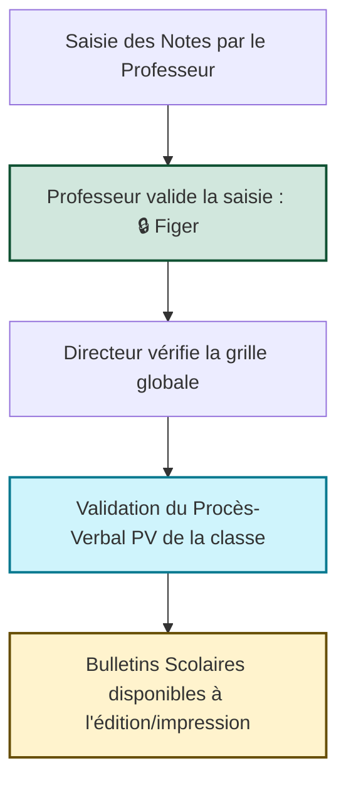

# 📘 GUIDE D'UTILISATION NUMÉRIQUE
## ERP de Gestion Scolaire & Emploi du Temps (« BARAKAT »)

Ce guide décrit l'ensemble des modules et fonctionnalités de l'application, les rôles des utilisateurs ainsi que la marche à suivre pour chaque procédure de gestion.

---

## 🗺️ Table des Matières
1. [Rôles & Gestion des Accès (RBAC)](#1-rôles--gestion-des-accès-rbac)
2. [Tableau de Bord & Indicateurs](#2-tableau-de-bord--indicateurs)
3. [Gestion des Emplois du Temps (EDT)](#3-gestion-des-emplois-du-temps-edt)
4. [Gestion Académique (Élèves, Matières & Coefficients)](#4-gestion-académique-élèves-matières--coefficients)
5. [Enseignants & Professeurs Principaux](#5-enseignants--professeurs-principaux)
6. [Registre d'Évaluation & Notes (Saisie des Moyennes)](#6-registre-dévaluation--notes-saisie-des-moyennes)
7. [Procédure de Saisie & de Validation des Bulletins](#7-procédure-de-saisie--de-validation-des-bulletins)
8. [Module Financier (Écolages & Recettes)](#8-module-financier-écolages--recettes)

---

## 1. Rôles & Gestion des Accès (RBAC)
L'application intègre un contrôle d'accès strict basé sur les rôles et permissions personnalisées.

### Les Profils Utilisateurs
| Rôle | Description | Droits d'Accès par Défaut |
|---|---|---|
| **Directeur / Super Admin** | Administrateur général de l'établissement. | Accès total à tous les onglets, modification des droits, déverrouillage des notes figées, validation finale des Procès-Verbaux (PV). |
| **Correspondant Fichier (Informaticien)** | Gestionnaire technique des bases de données. | Accès aux configurations d'emplois du temps, inscriptions d'élèves, saisies administratives et déblocages de notes. |
| **Professeur** | Enseignant responsable de disciplines. | Accès restreint à son emploi du temps personnel et à l'onglet de saisie de ses moyennes uniquement s'il y est expressément autorisé. |

### ⚙️ Octroyer des permissions (Ex: Saisie des Moyennes)
Seul le **Directeur** ou le **Super Admin** peut gérer ces droits :
1. Allez dans l'onglet **Administration**.
2. Dans la liste des comptes utilisateurs, cochez ou décochez l'autorisation **"Saisie des Moyennes"** (`saisie_moyennes`).
3. La modification est prise en compte instantanément pour l'utilisateur sans qu'il ait besoin de se déconnecter.

---

## 2. Tableau de Bord & Indicateurs
Le Tableau de Bord offre une synthèse visuelle immédiate des indicateurs de l'établissement :
* **Cartes de synthèse** colorées avec des fonds thématiques pour une meilleure lisibilité :
  - **Effectif Total** (Bleu) : Nombre d'élèves inscrits.
  - **Taux de Remplissage des Salles** (Vert/Émeraude) : Optimisation de l'espace.
  - **Cours Planifiés** (Indigo) : Volume d'activité hebdomadaire.
  - **Professeurs Actifs** (Orange) : Ratio d'encadrement.
* **Graphiques statistiques** : répartition par classe, par genre et taux de présence.

---

## 3. Gestion des Emplois du Temps (EDT)
Ce module permet d'élaborer la grille horaire hebdomadaire et de détecter automatiquement les conflits.

### Planification d'un cours
1. Allez sur **EDT - Planification**.
2. **Formulaire de création** : Sélectionnez la classe, le professeur, la matière, la salle, le jour de la semaine et le créneau horaire.
3. L'application vérifie automatiquement les conflits :
   - *Le professeur est-il déjà occupé sur ce créneau ?*
   - *La salle est-elle déjà réservée ?*
   - *Le créneau fait-il partie des indisponibilités déclarées du professeur ?*
4. En cas de conflit, une alerte s'affiche et bloque la création pour garantir la cohérence des plannings.

### Impression et Export
* Les plannings peuvent être filtrés par **Classe** ou par **Enseignant** pour une édition propre, prête à l'impression physique.

---

## 4. Gestion Académique (Élèves, Matières & Coefficients)
### Configuration des matières et coefficients
* Chaque matière est dotée d'un **coefficient** (poids) entrant dans le calcul des moyennes pondérées des bulletins.
* Les langues vivantes 2 (LV2) comme l'Espagnol ou l'Allemand peuvent être cochées comme telles pour une catégorisation automatique sur le bulletin.

### Inscription des élèves
* Permet d'ajouter des élèves, de définir leur genre et de les affecter à une classe d'étude.

---

## 5. Enseignants & Professeurs Principaux
* **Gestion des indisponibilités** : Déclaration des plages horaires où l'enseignant est absent ou indisponible.
* **Attribution de Professeur Principal** : Affectation d'un professeur référent à chaque classe d'étude. Il sera mentionné sur le bulletin officiel.

---

## 6. Registre d'Évaluation & Notes (Saisie des Moyennes)
Pour garantir la sécurité et la traçabilité des données d'évaluation, deux méthodes de saisie coexistent avec un contrôle strict.

### A. Le Portail Enseignant (Saisie des Moyennes)
Destiné aux professeurs autorisés par la Direction :
1. Le professeur sélectionne sa classe et sa matière attribuée.
2. Il saisit les notes de chaque élève pour un devoir/examen donné.
3. **Important** : Une fois la saisie terminée, le professeur clique sur **"🔒 Valider & Figer"** :
   - Les notes passent au statut **Figé**.
   - Le professeur ne peut plus modifier ni supprimer ces notes.
   - Seul le **Directeur** ou l'**Informaticien** a la main pour effectuer un correctif en cas d'erreur.

### B. Le Registre Administratif (Onglet Évaluations)
Destiné au Directeur et au Correspondant Fichier :
* Permet de saisir les notes des élèves manuellement.
* Permet de supprimer n'importe quelle note erronée.
* Si un utilisateur non autorisé tente d'y accéder, l'application affiche un écran **"Accès Restreint 🔒"** et bloque le formulaire.

---

## 7. Procédure de Saisie & de Validation des Bulletins

Pour éviter la publication de bulletins contenant des notes incomplètes ou non approuvées, le système impose le workflow suivant :

### Étape 1 : Saisie et Clôture
Chaque professeur saisit ses notes et valide sa discipline.

### Étape 2 : Vérification via la "Natte"
Le Directeur consulte la grille de notes (la Natte) pour s'assurer que toutes les disciplines ont été évaluées.

### Étape 3 : Validation du Procès-Verbal (PV)
1. Allez dans l'onglet **Évaluations**, sous-onglet **Procès-Verbaux & Validation**.
2. Sélectionnez la classe concernée.
3. Cliquez sur **"Valider le PV pour cette Classe"**.
4. Cette action verrouille définitivement la classe pour le trimestre et génère le rapport officiel du Procès-Verbal.

### Étape 4 : Impression des Bulletins
* L'onglet **Éditeur de Bulletins** n'affiche le bulletin individuel d'un élève **que si le PV de sa classe a été validé** à l'étape précédente.
* Si le PV n'est pas validé, un message d'avertissement s'affiche demandant la validation préalable du Directeur.

---

## 8. Module Financier (Écolages & Recettes)
Ce module assure la traçabilité des règlements de scolarité.

### Enregistrement d'un paiement
1. Sélectionnez l'élève concerné.
2. Saisissez le montant versé, le motif (Frais d'inscription, Scolarité 1er Trimestre, etc.) et le mode de règlement.
3. L'application met à jour le solde restant de l'élève.

### Édition de Reçu PDF & Notification
* Génération instantanée d'un reçu au format PDF officiel de l'école.
* Intégration d'un bouton d'envoi rapide pour partager le reçu par SMS ou WhatsApp aux parents d'élèves.
